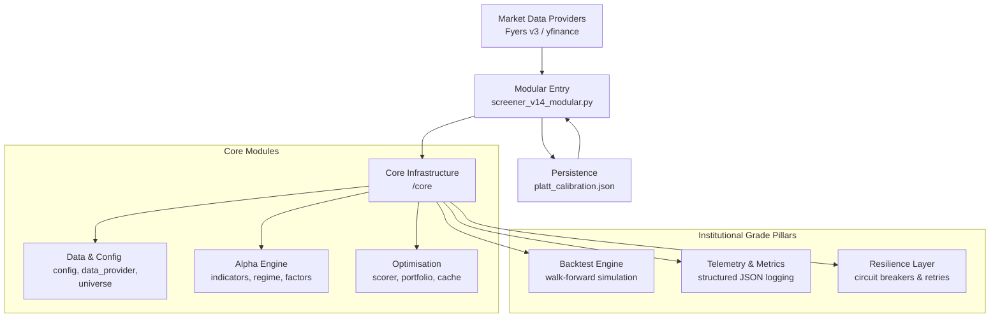

# 🦅 Sovereign Engine v14.2: Institutional Modular Infrastructure

Sovereign Engine is a professional-grade quantitative trading architecture designed for high-fidelity scanning, probabilistic setup evaluation, and automated portfolio optimization. 

> [!IMPORTANT]
> **v14.2 Performance & Resilience**: This version introduces **Exponential Backoff with Full Jitter** for data fetching and a **10-20x speedup** in volume profiling via NumPy vectorisation.

---

## 🌌 System Architecture

The project features a high-performance modular architecture where each component is an isolated logic bucket, optimized for concurrency and resilience:

---

## 🧠 Core Methodology

### 1. Unified 7-Factor Model (v14.0)
The engine evaluates the Nifty 200 universe using 7 orthogonal factors, fully implemented in `core/factors.py` with zero placeholders:
- **Trend (28%)**: Multi-timeframe EMA alignment + vectorised Supertrend.
- **Momentum (20%)**: RSI-Wilder, MACD Histogram acceleration, and directional streaks.
- **Volume (18%)**: RVOL, POC proximity, and Value Area (VAH/VAL) positioning.
- **Volatility (12%)**: ATR coiling (relative to 50d mean) + Bollinger Band Squeeze.
- **Relative Strength (12%)**: Sector-relative performance vs Nifty 50 Benchmark.
- **Breakout (6%)**: 52-week high proximity and BB-Width consolidation.
- **Quality (4%)**: 63-day log momentum, directional persistence, and ATR expansion.

### 2. Probabilistic Framework (Platt Scaling)
Every setup is transformed into a **Win Probability P(Win)** using calibrated **Platt scaling**. The v14.0 system automatically loads and saves `platt_calibration.json` to ensure consistent execution across restarts and backtests.

### 3. Institutional Risk Management
- **CapitalScaler (FIX 2)**: NAV-aware position sizing. The system scales risk proportional to your live portfolio value (pro-rated against a 50x risk-per-trade par NAV). Automatically scales down during drawdowns and up during hot streaks.
- **Fat-Tail Kelly Sizing**: Position sizing corrected for excess kurtosis (fat tails) to prevent over-leverage in volatile names.
- **Correlation Gate**: Optimized portfolio selection using a `MAX_CORR` filter (0.70 default) to ensure ticker diversification.
- **Regime Breadth Veto**: Automatic trading suspension (PANIC mode) when market breadth falls below critical thresholds.

---

## 📦 Institutional Modules (`/core`)

| Module | Description |
| :--- | :--- |
| `backtest.py` | **Walk-Forward Engine**: Multi-fold simulation with Sharpe, MaxDD, and Hit-Rate metrics. |
| `telemetry.py` | **Structured Logging**: Emits JSON-line metrics for log aggregators (ELK/Loki compatible). |
| `retry.py` | **Resilience Layer**: Circuit breakers and exponential backoff for Fyers/yfinance APIs. |
| `factors.py` | **Alpha Logic**: Decoupled factor computation with strict **FIX 4** data-quality gates. |
| `regime.py` | **Regime Tracker**: 5-state classification with confirmation-lag protection. |
| `portfolio.py` | **Optimizer**: Correlation-aware selection and **NAV-aware scaling** (CapitalScaler). |

---

## 🖥️ Operations

### Quick Start (Windows)
Double-click **`run_watch.bat`** to launch the engine in 15-minute Watch Mode.

### Command Line Interface
- **Production Scan**: `python screener_v14_modular.py`
- **Watch Mode**: `python screener_v14_modular.py --watch 15` (Periodic execution).
- **Backtest**: `python screener_v14_modular.py --backtest --days 180`
- **Calibration**: `python screener_v14_modular.py --calibrate` (Refit Platt A/B from trade logs).
- **Debug Trace**: `python screener_v14_modular.py --debug`

---

## ⚙️ Configuration
1. **Environment**: Copy `.env.example` to `.env`.
2. **API Access**: Configure `FYERS_CLIENT_ID` and `FYERS_SECRET_KEY`.
3. **Daily Token**: Run `python fyers_setup.py` daily to refresh Fyers access tokens.
4. **Telegram**: Set `TELEGRAM_BOT_TOKEN` and `TELEGRAM_CHAT_ID` for real-time alerts.

---

## 🧪 Testing & Quality
- **Unit Tests**: Run `pytest tests/` to verify core logic.
- **Type Safety**: Fully typed with Python 3.10 `|` unions and `from __future__ import annotations`.
- **Performance**: Vectorised indicators and `ThreadPoolExecutor` parallel scoring.

---
**Disclaimer**: *Sovereign Engine is a high-performance quantitative tool. All estimates are probabilistic. Trade responsibly.*
