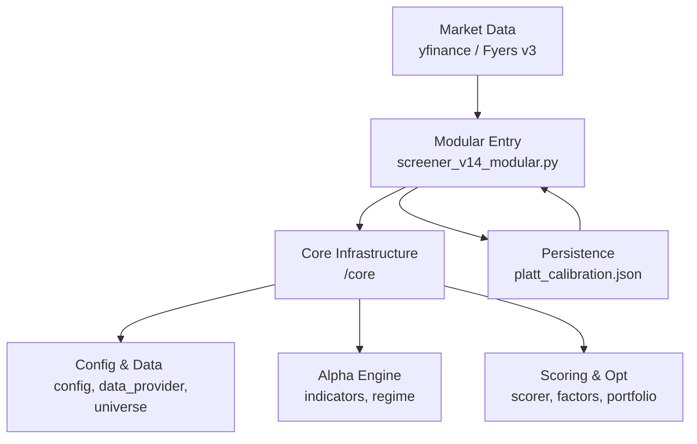

# 🦅 Sovereign Engine v14.0: Institutional Modular Infrastructure

Sovereign Engine is a professional-grade quantitative trading architecture designed for high-fidelity scanning, probabilistic setup evaluation, and automated portfolio optimization. 

> [!IMPORTANT]
> **v14.0 Modular Refactor**: Complete separation of concerns. All runtime state has been moved to `ScanState`, making the engine thread-safe, immutable, and fully testable.

---

## 🌌 System Architecture

The project has transitioned to a fully modular architecture where each component is an isolated logic bucket:



---

## 🧠 Core Methodology

### 1. Unified 7-Factor Model (v14.0)
The engine evaluates 178 leaders using 7 orthogonal factors, now fully implemented in `core/factors.py` with zero placeholders:
- **Trend (28%)**: Multi-timeframe EMA + Vectorised Supertrend.
- **Momentum (20%)**: RSI-Wilder, MACD Histogram acceleration, and directional streaks.
- **Volume (18%)**: RVOL, POC proximity, and Value Area (VAH/VAL) positioning.
- **Volatility (12%)**: ATR contracting relative to 50d mean (coiling) + BB Squeeze.
- **Relative Strength (12%)**: Sector-relative performance vs Nifty50 Benchmark.
- **Breakout (6%)**: 52-week high proximity and BB-Width consolidation.
- **Quality (4%)**: 63-day log momentum, directional persistence, and ATR expansion.

### 2. Probabilistic Framework
Every setup is transformed into a **Win Probability P(Win)** using calibrated **Platt scaling**. The v14.0 entry point automatically loads and saves `platt_calibration.json` to ensure consistent execution across restarts.

### 3. Market Regime Classification
Recognizes 5 states: `TREND_UP`, `TREND_DOWN`, `EXPANSION`, `RANGE`, and `PANIC`. v14.0 introduces stricter confirmed/unconfirmed logic and breadth-based panic protection.

---

## 🛠️ Components

### 📦 Modular Micro-Core (`/core`)
- `config.py`: Immutable system parameters and IST session logic.
- `universe.py`: **[NEW]** Single source of truth for the 165+ ticker universe and sector maps.
- `factors.py`: **[NEW]** Isolated alpha factor logic for individual testing.
- `data_provider.py`: Resilient fetching with Fyers-first and chunked `yfinance` fallback.
- `indicators.py`: Fully vectorised technical indicator suite.
- `regime.py`: Market state awareness and RS computation.
- `scorer.py`: Individual ticker evaluation engine.
- `portfolio.py`: Correlation-aware portfolio optimizer and Kelly sizing.

### 🖥️ Unified Scanner UI
A premium web dashboard for real-time trade planning:
- Use `python screener_v14_modular.py` for the backend scan.
- Dashboard views are available via `dashboard.html`.

---

## 🚀 Operations

### Setup
```bash
# Recommended: Python 3.10+
pip install yfinance pandas numpy scipy scikit-learn pytz requests python-dotenv openpyxl fyers-apiv3
```

### Execution Commands
- **Production Scan**: `python screener_v14_modular.py` (New modular entry).
- **Watch Mode**: `python screener_v14_modular.py --watch 15` (Scans every 15 mins).
- **Debug Scan**: `python screener_v14_modular.py --debug` (Detailed signal trace).
- **No Telegram**: `python screener_v14_modular.py --no-telegram` (Silent local run).
- **Legacy Monolith**: `python screener.py` (v13.0 archived).

---

## ⚙️ Configuration
1. Copy `.env.example` to `.env`.
2. Configure **Telegram** (`TELEGRAM_BOT_TOKEN`, `TELEGRAM_CHAT_ID`).
3. Configure **Fyers API v3** for low-latency data.
4. Run `python fyers_setup.py` daily to refresh access tokens.

---
**Disclaimer**: *Sovereign Engine is a high-performance quantitative tool. All estimates are probabilistic. Quantitative models can fail during regime shifts. Trade responsibly.*
