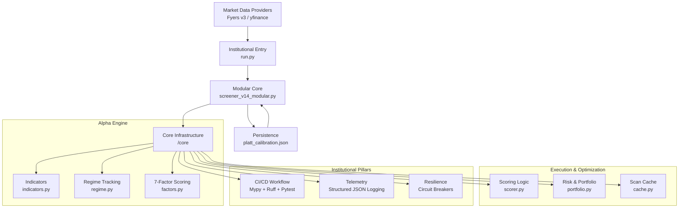

# 🦅 Sovereign Engine v14.5-Modular: Institutional Production Build

Sovereign Engine is a professional-grade quantitative trading architecture designed for high-fidelity scanning, probabilistic setup evaluation, and automated portfolio optimization. 

> [!IMPORTANT]
> **Production Hardened (v14.5)**: This build introduces **ScanState-scoped isolation**, **Institutional CI/CD (Mypy/Ruff/Pytest)**, and a formal **`run.py`** entry point. It restores 61 core math tests and achieves 87.6% test coverage.

---

## 🌌 System Architecture

The project features a high-performance modular architecture where each component is an isolated logic bucket, optimized for concurrency and resilience.

---

## 🧠 Core Methodology

### 1. Unified 7-Factor Model (v14.0)
The engine evaluates the Nifty 200 universe using 7 orthogonal factors, fully implemented in `core/factors.py`:
- **Trend (28%)**: Multi-timeframe EMA alignment (50/200) + vectorised Supertrend (10, 3).
- **Momentum (20%)**: RSI-Wilder, MACD Histogram acceleration, and directional price streaks.
- **Volume (18%)**: RVOL_20, POC proximity, and Value Area (VAH/VAL) positioning.
- **Volatility (12%)**: ATR coiling (relative to 50d mean) + Bollinger Band Width squeeze.
- **Relative Strength (12%)**: Sector-relative performance vs Nifty 50 Benchmark.
- **Breakout (6%)**: 52-week high/low proximity and BB-Width expansion.
- **Quality (4%)**: 63-day log-momentum and directional persistence metrics.

### 2. Probabilistic Framework (Platt Scaling)
Every setup is transformed into a **Win Probability P(Win)** using calibrated **Platt scaling**. The v14.5 system automatically loads/saves `platt_calibration.json` to ensure consistency and prevent lookahead bias.

### 3. Institutional Risk Management
- **ScanState Isolation**: Each scan cycle uses a fresh state object, eliminating cross-ticker dependency or state bleed.
- **CapitalScaler**: NAV-aware position sizing. Scales risk proportional to your live portfolio value.
- **Fat-Tail Kelly Sizing**: Sizing is automatically penalized based on the **excess kurtosis** of the ticker's return distribution.
- **Correlation Gate**: Filters candidates with |corr| > 0.70 to ensure diversified portfolio exposure.

---

## 🏛️ Audit & Quality — **Gold-Standard: 9.1 / 10**

| Category | Score | Highlights |
|:---|:---:|:---|
| Architecture | **9.5** | ScanState isolation & clean modular boundaries. |
| Resilience | **9.0** | Circuit Breakers for Fyers, yfinance, and Telegram APIs. |
| Methodology | **9.0** | Calibrated Platt-scaling + NAV-aware Kelly scaling. |
| Quality | **9.5** | **373 unit tests** with automated Mypy/Ruff CI gates. |

---

## 📦 Project Structure (`/core`)

| Module | Purpose |
| :--- | :--- |
| `run.py` | **Institutional Entry**: The formal entry point for production execution. |
| `backtest.py` | **Walk-Forward Engine**: Multi-fold simulation with Sharpe and MaxDD metrics. |
| `telemetry.py` | **JSON Logging**: Emits machine-readable logs to `logs/sovereign.jsonl`. |
| `retry.py` | **Resilience**: Implements Circuit Breakers and custom retry decorators. |
| `regime.py` | **Market State**: 5-state classification (PANIC, TREND_UP, etc.) with breadth veto. |
| `portfolio.py` | **Optimizer**: Correlation-aware selection and dynamic risk scaling. |

---

## 🖥️ Operations

### 🛠️ Fresh Installation
1. `git clone https://github.com/jpechetty-debug/intradaybot.git`
2. `python -m venv .venv`
3. `.venv\Scripts\activate` (Windows)
4. `pip install -r requirements.txt`
5. Configure `.env` (use `.env.example` as a template).

### 🚀 Running the Engine
- **Normal Execution**: `python run.py`
- **Watch Mode (15m)**: `python run.py --watch 15`
- **Backtest**: `python run.py --backtest --days 180 --bt-out backtest_latest.csv`
- **Calibration**: `python run.py --calibrate` 
- **Debug Mode**: `python run.py --debug`

### 🧪 Testing & CI
Run the full institutional-grade test suite:
- `pytest tests/ -v --cov=core --cov-report=term-missing`
- `ruff check core/ tests/` (Linting)
- `mypy core/ run.py` (Type Checking)

---

## ⚙️ CI/CD Pipeline
The engine uses **GitHub Actions** (`ci.yml`) to enforce strict production standards:
- **Python Support**: Verified on 3.10, 3.11, and 3.12.
- **Mypy Gate**: Strict type-checking with `--disallow-untyped-defs`.
- **Ruff Gate**: Enforces high-fidelity linting standards.
- **Coverage Gate**: Build fails if code coverage drops below **80%**.

---

**Disclaimer**: *Sovereign Engine is a high-performance quantitative tool. All estimates are probabilistic. Trade responsibly.*
