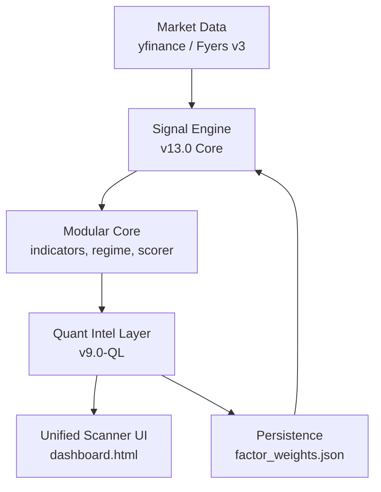

# 🦅 Sovereign Engine v13.0+: Institutional Quantitative Infrastructure

Sovereign Engine is a professional-grade quantitative trading architecture designed for high-fidelity scanning, probabilistic setup evaluation, and automated portfolio optimization. 

> [!IMPORTANT]
> **v13.0 Core Upgrade**: Fully vectorised Supertrend, hardware-agnostic (no Numba), and out-of-sample ICIR factor calibration.

---

## 🌌 System Architecture

The project has evolved into a multi-layered modular architecture for improved scalability and intelligence:



---

## 🧠 Core Methodology

### 1. The Multi-Factor Model (v13.0)
The engine evaluates 178 leaders using 7 orthogonal factors, now optimized with **Price Momentum Quality (Fix C)**:
- **Trend (28%)**: Multi-timeframe EMA + Vectorised Supertrend.
- **Momentum (20%)**: RSI-Wilder, MACD Histogram acceleration.
- **Volume (18%)**: RVOL, POC proximity, Value Area (VAH/VAL).
- **Volatility (12%)**: ATR percentiles + Bollinger Band Squeeze.
- **Relative Strength (12%)**: Sector-relative performance vs Benchmark.
- **Breakout (6%)**: 52-week high proximity & consolidation.
- **Quality (4%)**: *New* 63d Price Momentum + Directional Persistence + ATR Expansion.

### 2. Probabilistic Framework
Every setup is transformed into a **Win Probability P(Win)** using calibrated **Platt scaling** (auto-persisted to `platt_calibration.json`). Only setups clearing the probability gate (default 52%) enter the portfolio.

### 3. Market Regime Classification
Recognizes 5 states: `TREND_UP`, `TREND_DOWN`, `EXPANSION`, `RANGE`, and `PANIC` (Automatic capital protection).

---

## 🛠️ Components

### 🧠 Quant Intelligence Layer (`v9.0-QL`)
The `sovereign_quant_layer.py` acts as the portfolio brain:
- **Ridge Regression**: Optimizes factor weights based on historical trade logs.
- **Platt & Isotonic**: Advanced probability calibration.
- **Volatility Targeting**: Position scaling to hit specific annual volatility targets.
- **Capital Allocation**: Regime-aware risk budgeting.

### 🖥️ Unified Scanner UI (`dashboard.html`)
A premium web dashboard for real-time trade planning and technical verification:
- **33 EMA Signal**: Strategy-specific candle body & RSI filters.
- **8-Param Screener**: Full technical + fundamental scorecard.
- **Dynamic Trade Plan**: Interactive level visualization and RR calculation.

### 📦 Modular Micro-Core (`/core`)
- `config.py`: Centralized system parameters.
- `data_provider.py`: Unified fetch logic (yfinance + Fyers).
- `indicators.py`: Vectorised indicator suite.
- `regime.py`: Market state awareness.
- `scorer.py`: Individual ticker evaluation.

---

## 🚀 Operations

### Setup
```bash
# Recommended: Python 3.10+
pip install yfinance pandas numpy scipy scikit-learn pytz requests python-dotenv openpyxl fyers-apiv3
```

### Execution Commands
- **Standard UI Scan**: `python screener.py --ui` (Launches with Dashboard links).
- **Factor Calibration**: `python screener.py --calibrate` (Runs held-out ICIR analysis).
- **Watch Mode**: `python screener.py --watch 15` (Continuous interval scanning).
- **Quant Optimization**: `python sovereign_quant_layer.py --full` (Re-fits weights).
- **Modular Test**: `python screener_v13_modular.py` (Experimental modular path).

---

## ⚙️ Configuration
1. Copy `.env.example` to `.env`.
2. Configure **Telegram** (`TELEGRAM_BOT_TOKEN`, `TELEGRAM_CHAT_ID`).
3. Configure **Fyers API v3** for low-latency intraday data.
4. Run `python fyers_setup.py` daily to refresh access tokens.

---
**Disclaimer**: *Sovereign Engine is a high-performance quantitative tool. All estimates are probabilistic. Quantitative models can fail during regime shifts. Trade responsibly.*
