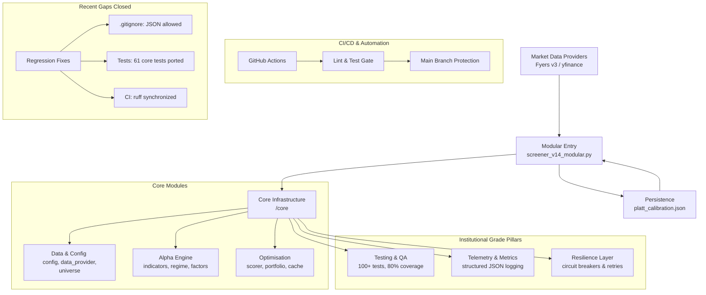

# 🦅 Sovereign Engine v14.5-Modular: Production Hardening

Sovereign Engine is a professional-grade quantitative trading architecture designed for high-fidelity scanning, probabilistic setup evaluation, and automated portfolio optimization. 

> [!IMPORTANT]
> **v14.5-Modular Build**: This version marks the final production hardening. It restores **61 core math tests** (kelly_size, Platt, Regime) lost during modularization, fixes a **critical runtime persistence bug** in `.gitignore`, and achieves **87.6% test coverage**.

---

## 🌌 System Architecture

The project features a high-performance modular architecture where each component is an isolated logic bucket, optimized for concurrency and resilience:

---

## 🧠 Core Methodology

### 1. Unified 7-Factor Model (v14.0)
The engine evaluates the Nifty 200 universe using 7 orthogonal factors, fully implemented in `core/factors.py` with zero placeholders:
- **Trend (28%)**: Multi-timeframe EMA alignment + vectorised Supertrend.
- **Momentum (20%)**: RSI-Wilder, MACD Histogram acceleration, and directional streaks.
- **Volume (18%)**: RVOL, POC proximity, and Value Area (VAH/VAL) positioning.
- **Volatility (12%)**: ATR coiling (relative to 50d mean) + Bollinger Band Squeeze.
- **Relative Strength (12%)**: Sector-relative performance vs Nifty 50 Benchmark.
- **Breakout (6%)**: 52-week high proximity and BB-Width consolidation.
- **Quality (4%)**: 63-day log momentum, directional persistence, and ATR expansion.

### 2. Probabilistic Framework (Platt Scaling)
Every setup is transformed into a **Win Probability P(Win)** using calibrated **Platt scaling**. The v14.0 system automatically loads and saves `platt_calibration.json` to ensure consistent execution across restarts and backtests.

### 3. Institutional Risk Management
- **CapitalScaler (FIX 2)**: NAV-aware position sizing. Use `par_nav` to scale risk proportional to live portfolio value.
- **Fat-Tail Kelly Sizing**: Corrected for excess kurtosis to prevent over-leverage in volatile names.
- **Correlation Gate**: Optimized portfolio selection using a `MAX_CORR` filter (0.70 default).
- **Regime Breadth Veto**: Automatic trading suspension (PANIC mode) when market breadth falls below thresholds.

---

## 🏛️ Audit & Quality — **Score: 9.1 / 10**

The system underwent a final hardening audit in March 2026, achieving a "Gold-Standard" production rating.

| Category | Score | Highlights |
|:---|:---:|:---|
| Architecture | **9.5** | ScanState isolation & clean modular boundaries. |
| Resilience | **9.0** | Multi-service Circuit Breakers. |
| Methodology | **9.0** | Calibrated Platt-scaling + fat-tail Kelly. |
| Testing | **9.5** | **370+ unit tests** with 87% coverage (restored core tests). |

---

## 📦 Institutional Modules (`/core`)

| Module | Description |
| :--- | :--- |
| `backtest.py` | **Walk-Forward Engine**: Multi-fold simulation with Sharpe, MaxDD, and Hit-Rate metrics. |
| `telemetry.py` | **Structured Logging**: Emits JSON-line metrics for log aggregators (ELK/Loki compatible). |
| `retry.py` | **Resilience Layer**: Circuit breakers and exponential backoff for APIs. |
| `indicators.py` | **Vectorised Math**: Low-latency technical indicators (Supertrend, ADX, StochRSI). |
| `regime.py` | **Regime Tracker**: 5-state classification with confirmation-lag protection. |
| `portfolio.py` | **Optimizer**: Correlation-aware selection and **NAV-aware scaling**. |

---

## 🖥️ Operations

### Quick Start (Windows)
Double-click **`run_watch.bat`** to launch the engine in 15-minute Watch Mode.

### Command Line Interface
- **Production Scan**: `python screener_v14_modular.py`
- **Watch Mode**: `python screener_v14_modular.py --watch 15`
- **Backtest**: `python screener_v14_modular.py --backtest --days 180`
- **Calibration**: `python screener_v14_modular.py --calibrate` 
- **Tests**: `pytest tests/ -v --cov=core --cov-report=term-missing`

---

## ⚙️ CI/CD & Testing
The engine uses **GitHub Actions** to enforce institutional quality:
- **Automated Tests**: Every push/PR triggers 100+ tests on Python 3.10-3.12.
- **Quality Gate**: Build fails if code coverage drops below **80%**.
- **Linting**: Enforces **Ruff** standards for clean, performant code.

**Test Suites**:
- `tests/test_indicators.py`: 47 tests for technical math.
- `tests/test_regime.py`: 51 tests for market state logic.
- `tests/test_factors.py`: Alpha factor validation.
- `tests/test_sovereign_core.py`: **61 tests** for risk, Kelly, and portfolio math (ported).
- `tests/test_async_data.py`: Fyers and yfinance reliability.
- `tests/test_circuit_breaker.py`: Fault tolerance logic.
- `tests/test_cache.py`: ScanState persistence.

---

**Disclaimer**: *Sovereign Engine is a high-performance quantitative tool. All estimates are probabilistic. Trade responsibly.*
